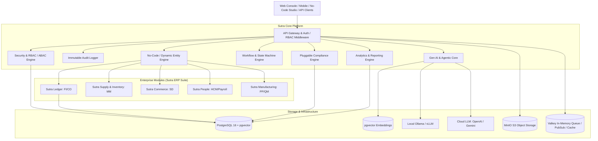

# Sutra — The Open Enterprise Operating System (EOS)
## Architectural Blueprint & Technical Specification

> **Vision**: An open-source, modern, security-first enterprise operating system designed to replace legacy ERP giants (like SAP S/4HANA), eliminating proprietary lock-in while leveraging modern cloud-native technologies, no-code extensibility, and integrated Generative AI.

---

### 1. Executive Summary & Core Value Proposition

| Dimension | Legacy SAP (ECC / S/4HANA) | **Sutra (The Open Enterprise OS)** |
| :--- | :--- | :--- |
| **Licensing** | Opaque, multi-million dollar user/core lock-in | **Apache 2.0 Open Source** (Self-hostable & Cloud-ready) |
| **Tech Stack** | Proprietary ABAP, HANA DB, NetWeaver | **Node.js/TypeScript, PostgreSQL (with pgvector), MinIO, Docker** |
| **Extensibility** | Complex ABAP modifications, fragile BAPIs | **No-Code / Low-Code Studio** (Visual schema, flow & UI builders) |
| **Compliance** | Costly localized add-ons & consultant-heavy setup | **Native Jurisdiction Engines** (*India-first*: GST, E-Invoice, TDS, PF) |
| **Gen AI** | Bolt-on legacy copilot tied to vendor cloud | **Dual-Engine Gen AI** (Local Ollama/vLLM or Cloud OpenAI/Gemini/Anthropic) |
| **Architecture** | Heavy monolith with bloated microservices | **Modular Micro-Core**, Event-Driven, Multi-Tenant, API-First |
| **Deployment** | Months/Years of infrastructure provisioning | **Instant Single-Command Docker Compose** or Cloud Kubernetes |

---

### 2. High-Level System Architecture

---

### 3. Core Pillars & Design Principles

#### 3.1 Security-First, Pluggable Authentication & Multi-Tenancy
* **Pluggable Authentication System (`AuthPluginRegistry`)**:
  * Clean, extensible interface (`IAuthProvider`) allowing seamless switching between built-in JWT authentication and enterprise third-party identity providers without changing business logic.
  * **Built-in JWT Provider (`LocalJwtAuthProvider`)**: bcrypt password hashing (`$2b$10$...`), cryptographically signed JWT access tokens (RS256/HS256) with 24-hour validity, refresh token rotation, and claims-based identity resolution.
  * **Enterprise OIDC Plugin (`OidcAuthProvider`)**: Turnkey OpenID Connect federation for Microsoft Entra ID (Azure AD), Okta, Keycloak, and Google Workspace.
  * **Enterprise SAML 2.0 Plugin (`SamlAuthProvider`)**: Standard Web Browser SSO profile for ADFS, Okta SAML, and Ping Identity.
  * **Tenant-Level Auth Policies**: Different enterprise tenants within the same Sutra instance can enforce different identity providers (e.g. Tenant A uses local JWT, while Tenant B enforces corporate Azure AD SSO).
* **Granular RBAC + ABAC**: Roles (`SuperAdmin`, `CFO`, `ProcurementOfficer`, `Auditor`) paired with Attribute-Based Access Control (e.g., restricting access by `company_id`, `branch_id`, or `amount_limit`).
* **Multi-Tenant Architecture**: Schema-per-tenant or isolated tenant scoping with PostgreSQL Row-Level Security (RLS).
* **Cryptographic Audit Trail**: Immutable append-only audit log tracking every data mutation, actor IP, user agent, previous state, and diff for statutory compliance (SOX, Indian Companies Act, GDPR).
* **Data Encryption**: Transparent Data Encryption (TDE) compatibility, column-level tokenization for sensitive financial and identity records (PAN, GSTIN, Bank Accounts).

#### 3.2 No-Code / Low-Code Extensibility ("Sutra Studio")
* **Dynamic Entity Engine**: Define custom business entities, relations (One-to-Many, Many-to-Many), and validation constraints dynamically without writing database migrations.
* **Visual Workflow Automations**: Event-triggered pipelines (e.g., *"When PO > ₹100,000, trigger CFO approval workflow via Email/WhatsApp, and upon approval generate Goods Receipt draft"*).
* **Configurable Layouts**: Dynamic form, table, Kanban, and dashboard views driven by declarative JSON schemas.

#### 3.3 Localization & Compliance (India First, World Configurable)
* **India-First Compliance Stack**:
  * **GST Engine**: HSN/SAC code mapping, CGST/SGST/IGST automatic computation, reverse charge, and tax invoice generation.
  * **E-Invoicing & E-Way Bill**: Compliant JSON schema output with QR code hashing (IRN format compliant with NIC standard).
  * **Tax Deducted at Source (TDS)**: Standard Indian sections (194C, 194J, 194Q, 206C) with automated rate lookup.
  * **Statutory Payroll**: Provident Fund (EPF), ESI, Professional Tax (state-wise), and Income Tax TDS estimation.
* **Global Pluggability**: Clean interface (`IComplianceProvider`) allowing plug-and-play modules for US Sales Tax, EU VAT, GCC ZATCA e-invoicing, etc.

#### 3.4 Embedded Analytics Engine
* **Operational Reporting**: Trial Balance, Profit & Loss (P&L), Balance Sheet, Aging Schedules, Inventory Turnover.
* **Hybrid OLAP**: Optimized PostgreSQL queries with materialized aggregations and extensible adapters for DuckDB / ClickHouse for multi-million row analytics.
* **Natural Language Queries**: Interfaced with the Gen AI engine for ad-hoc business intelligence questions.

#### 3.5 Native Gen AI Integration
* **Hybrid Provider Architecture**:
  * **Local / Air-Gapped**: Runs on Ollama / vLLM / llama.cpp for data privacy sensitive enterprises.
  * **Cloud**: High-throughput reasoning via OpenAI, Anthropic, or Google Gemini.
* **AI Capabilities**:
  * **Text-to-ERP**: Natural language querying over company data ("Which customers in Pune have unpaid invoices older than 45 days?").
  * **Intelligent Document Processing (IDP)**: Zero-shot PDF/Image invoice extraction to structured Bill of Entry.
  * **AI Copilot**: Automated discrepancy resolution, PO matching, and smart anomaly alerts.

#### 3.6 Enterprise Supply Chain & Operations (MM, SD, P2P, FI-AR/AP)
* **Materials Management (MM)**: Multi-type SKU catalog (`ROH`, `HALB`, `FERT`, `HAWA`), multi-warehouse plant/storage location tracking, Moving Average Price (MAP) continuous recalculation on receipt, and standard movement types (101, 102, 201, 311, 601).
* **Order-to-Cash (SD)**: Customer master with real-time credit limit enforcement, Available-to-Promise (ATP) stock checks, Outbound Delivery with Post Goods Issue (PGI Mvt 601), automated Cost of Goods Sold (COGS) accounting, and billing invoices linked to Indian E-Invoice IRN & E-Way bills.
* **Procure-to-Pay (P2P)**: Purchase Order workflow, dock Goods Receipt Notes (GRN Mvt 101), 3-Way Matching audit (PO vs GRN vs Vendor Invoice) with price/quantity tolerance gates, Indian Section 194Q TDS withholding, and MSME Section 43B(h) 45-day payment tracking.
* **Subledger Aging & Working Capital**: Real-time accounts receivable and accounts payable aging buckets (0-30, 31-60, 61-90, 90+ days), DSO and DPO metrics, and net working capital exposure forecasting.

#### 3.7 Production Planning & Manufacturing (PP)
* **Bill of Materials (BOM)**: Multi-level hierarchical component explosion with unit consumption formulas and scrap factor percentages.
* **Work Centers & Routings**: Capacity scheduling (hours/day), hourly direct labor and machine absorption cost rates, and sequential operation routings.
* **Production Orders**: Component availability checks, planned standard costing, work-in-progress (WIP) issuance (Movement Type 261), and batch confirmation to finished goods inventory (Movement Type 131) with balanced GL journal postings.

#### 3.8 Fixed Asset Accounting (FI-AA)
* **Asset Register**: Capital asset master data tracking acquisition cost, capitalization date, asset classes, and cost centers.
* **Statutory Depreciation**: Indian Companies Act 2013 Schedule II useful life mandates with salvage value capped at 5%. Straight Line Method (SLM) monthly depreciation run.
* **Automated Accounting**: Automated posting to Depreciation Expense (`530100 Dr`) and Accumulated Depreciation (`140900 Cr`) contra-asset accounts.

#### 3.9 Quality Management & Batch Traceability (QM)
* **Inspection Lots**: Automated lot trigger on Goods Receipt (01) and Production Confirmation (04) with quantitative (tolerances, min/max) and qualitative characteristics.
* **Usage Decisions (UD)**: Release to Unrestricted Stock (Movement Type 321), Reject to Blocked Stock (Movement Type 350), or Scrap (Movement Type 551).
* **Certificate of Analysis (CoA)**: Tamper-evident CoA generation with SHA-256 cryptographic verification hashes and QA authority sign-off.
* **End-to-End Batch Genealogy**: Bidirectional forward and backward traceability (Supplier Batch -> Production Order -> Finished Goods Lot -> Customer Invoices) for automotive and pharmaceutical quality recalls.

#### 3.10 Controlling & Management Accounting (CO)
* **Cost Center Accounting (CO-CCA)**: Multi-level cost center hierarchy, expense tracking, and profit center segment reporting.
* **Secondary Cost Assessment Cycles**: Periodic overhead allocation distributing shared services (IT, Facilities, Maintenance) across production work centers via allocation weights and balanced secondary cost element journals (GL `610000`).
* **Variance Analysis**: Automated budget vs actual cost variance calculation, classifying performance as Favorable, Unfavorable, or On Track.

#### 3.11 Plant Maintenance & Enterprise Asset Management (PM/EAM)
* **Equipment Master & Functional Locations**: Hierarchical functional location structure (`FLOC-*`), machine specifications, serial tracking, and operational status transitions (`OPERATIONAL`, `IN_MAINTENANCE`, `BREAKDOWN`, `DECOMMISSIONED`).
* **Maintenance Notifications & Work Orders**: Corrective, breakdown, and inspection notifications linked to work orders with technician scheduling, labor hours tracking, and spare parts reservation from MM Inventory (Movement Type `201`).
* **Preventive Maintenance Schedules**: Usage-based (operating hours counter) and time-based (interval days) recurring maintenance cycles.
* **Reliability Analytics**: Continuous computation of Mean Time Between Failures (MTBF), Mean Time To Repair (MTTR), and Overall Equipment Availability Percentage.
* **Cost Settlement**: Automatic settlement of combined work order labor and materials expense to the responsible Cost Center in Controlling (GL `510300`).

#### 3.12 Treasury Management & Bank Statement Reconciliation (TRM / FI-BL)
* **House Banks & Bank Accounts Master**: Multi-currency current accounts, Cash Credit, and Escrow facilities linked to primary GL cash accounts and intermediate bank clearing accounts (`100101`).
* **Electronic Bank Statement (EBS) Parsing**: Ingestion of standard SWIFT MT940 statement tags (`:60F:`, `:61:`, `:62F:`), CAMT.053, and banking CSV feeds.
* **Automated 2-Way Reconciliation Engine**: Multi-tiered matching algorithm (Exact Reference & Amount $\rightarrow$ Partial Reference & Amount $\rightarrow$ Amount within tolerance) scoring match confidence (70-100%) and auto-clearing matched items.
* **Bank Reconciliation Statement (BRS)**: Automated generation of statutory BRS reconciling Bank Statement Balance with Company Book Balance, tracking deposits in transit and unpresented cheques with zero-variance balance verification.
* **Cash Liquidity Forecasting**: Rolling 30, 60, and 90-day cash position forecasting synthesizing real-time bank balances, open customer accounts receivable (SD), and vendor accounts payable (P2P).

#### 3.13 API Standards & Standardized HTTP Status Constants
* **Named Constant Convention**: All API route handlers and middleware strictly avoid magic inline numeric HTTP status codes (e.g. `res.status(404)`).
* **`HttpStatus` Centralization**: Exported from `@sutra/core` following RFC 7231, RFC 7538, and RFC 6585 (e.g. `HttpStatus.OK`, `HttpStatus.CREATED`, `HttpStatus.BAD_REQUEST`, `HttpStatus.UNAUTHORIZED`, `HttpStatus.FORBIDDEN`, `HttpStatus.NOT_FOUND`, `HttpStatus.UNPROCESSABLE_ENTITY`, `HttpStatus.INTERNAL_SERVER_ERROR`).
* **Guaranteed Uniformity**: Single-source-of-truth status code dictionary across all monorepo micro-packages, plugins, and REST endpoints.

#### 3.14 Human Capital Management & Core HR (HCM)
* **Employee Master Data**: Comprehensive employee lifecycle records, organizational units, departmental cost center assignments, statutory identity identifiers (PAN, Aadhaar, UAN, ESIC IP), and structured CTC breakdown (Basic, HRA, Special Allowance, Conveyance, Medical).
* **Attendance & Loss of Pay (LOP)**: Monthly attendance period capture with calendar working days, present days, paid leaves, and automatic LOP pro-rata salary computation.
* **Statutory Indian Deductions Engine**:
  * **Employee Provident Fund (EPF)**: 12% contribution under EPFO rules capped at statutory wage ceiling (₹15,000 / ₹1,800 monthly limit) or uncapped basic.
  * **Employees' State Insurance (ESIC)**: 0.75% deduction for employees with monthly gross salary $\le$ ₹21,000.
  * **Professional Tax (PT)**: State-specific slabs (e.g., ₹200/month Maharashtra/Karnataka).
  * **Income Tax TDS (Section 192)**: Projected annual tax liabilities withheld on a monthly pro-rata basis.
* **Digital Payslip Generation**: Tamper-evident itemized salary vouchers detailing earned gross, statutory withholdings, net take-home salary, and masked bank disbursement account.
* **Automated General Ledger Payroll Voucher**: Multi-line balanced accounting voucher posting gross salary to Salaries & Wages Expense (`510000 Dr`) and credit lines to EPF Payable (`214100 Cr`), ESIC Payable (`214200 Cr`), PT Payable (`214300 Cr`), TDS Payable (`214400 Cr`), and Payroll Clearing / Net Salaries Payable (`214000 Cr`).

#### 3.15 Project Systems & Capital Project Costing (PS)
* **Project Master & CapEx/OpEx Classification**: Capital expenditure project creation, budget appropriation, planned start/completion scheduling, and Commercial Operation Date (COD) governance.
* **Work Breakdown Structure (WBS)**: Hierarchical element tree (`WBS-01-CIVIL`, `WBS-02-PRESS`, `WBS-03-AUTOMATION`) mapping budgets to specific engineering cost centers.
* **Commitment Accounting & Cost Tracking**: Real-time integration with Procure-to-Pay (P2P), locking committed budget against approved Purchase Orders (`budgetCommitted`) and actual expenditure upon Goods Receipt / Service Entry (`actualCostIncurred`).
* **Milestone Progress & Percentage of Completion (PoC)**: Weighted milestone tracking computing overall physical and financial project completion percentages.
* **Capital Work-in-Progress (CWIP) Settlement & Capitalization**: Seamless transfer of accumulated construction and engineering spend from CWIP asset clearing accounts (`140800 Cr`) into the active Fixed Asset Register (FI-AA, `140100 Dr`) upon project completion and commissioning.

