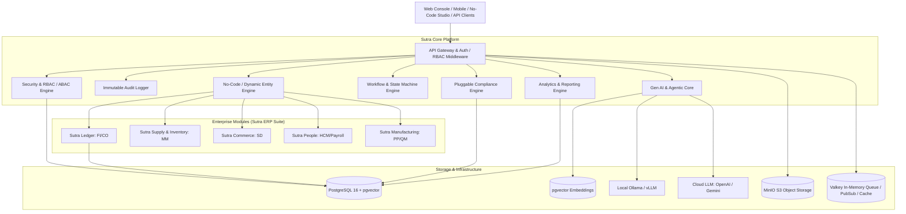

# Sutra — The Open Enterprise Operating System (EOS)
## Architectural Blueprint & Technical Specification

> **Vision**: An open-source, modern, security-first enterprise operating system designed to replace legacy ERP giants (like SAP S/4HANA), eliminating proprietary lock-in while leveraging modern cloud-native technologies, no-code extensibility, and integrated Generative AI.

---

### 1. Executive Summary & Core Value Proposition

| Dimension | Legacy SAP (ECC / S/4HANA) | **Sutra (The Open Enterprise OS)** |
| :--- | :--- | :--- |
| **Licensing** | Opaque, multi-million dollar user/core lock-in | **Apache 2.0 Open Source** (Self-hostable & Cloud-ready) |
| **Tech Stack** | Proprietary ABAP, HANA DB, NetWeaver | **Node.js/TypeScript, PostgreSQL (with pgvector), MinIO, Docker** |
| **Extensibility** | Complex ABAP modifications, fragile BAPIs | **No-Code / Low-Code Studio** (Visual schema, flow & UI builders) |
| **Compliance** | Costly localized add-ons & consultant-heavy setup | **Native Jurisdiction Engines** (*India-first*: GST, E-Invoice, TDS, PF) |
| **Gen AI** | Bolt-on legacy copilot tied to vendor cloud | **Dual-Engine Gen AI** (Local Ollama/vLLM or Cloud OpenAI/Gemini/Anthropic) |
| **Architecture** | Heavy monolith with bloated microservices | **Modular Micro-Core**, Event-Driven, Multi-Tenant, API-First |
| **Deployment** | Months/Years of infrastructure provisioning | **Instant Single-Command Docker Compose** or Cloud Kubernetes |

---

### 2. High-Level System Architecture

---

### 3. Core Pillars & Design Principles

#### 3.1 Security-First, Pluggable Authentication & Multi-Tenancy
* **Pluggable Authentication System (`AuthPluginRegistry`)**:
  * Clean, extensible interface (`IAuthProvider`) allowing seamless switching between built-in JWT authentication and enterprise third-party identity providers without changing business logic.
  * **Built-in JWT Provider (`LocalJwtAuthProvider`)**: bcrypt password hashing (`$2b$10$...`), cryptographically signed JWT access tokens (RS256/HS256) with 24-hour validity, refresh token rotation, and claims-based identity resolution.
  * **Enterprise OIDC Plugin (`OidcAuthProvider`)**: Turnkey OpenID Connect federation for Microsoft Entra ID (Azure AD), Okta, Keycloak, and Google Workspace.
  * **Enterprise SAML 2.0 Plugin (`SamlAuthProvider`)**: Standard Web Browser SSO profile for ADFS, Okta SAML, and Ping Identity.
  * **Tenant-Level Auth Policies**: Different enterprise tenants within the same Sutra instance can enforce different identity providers (e.g. Tenant A uses local JWT, while Tenant B enforces corporate Azure AD SSO).
* **Granular RBAC + ABAC**: Roles (`SuperAdmin`, `CFO`, `ProcurementOfficer`, `Auditor`) paired with Attribute-Based Access Control (e.g., restricting access by `company_id`, `branch_id`, or `amount_limit`).
* **Multi-Tenant Architecture**: Schema-per-tenant or isolated tenant scoping with PostgreSQL Row-Level Security (RLS).
* **Cryptographic Audit Trail**: Immutable append-only audit log tracking every data mutation, actor IP, user agent, previous state, and diff for statutory compliance (SOX, Indian Companies Act, GDPR).
* **Data Encryption**: Transparent Data Encryption (TDE) compatibility, column-level tokenization for sensitive financial and identity records (PAN, GSTIN, Bank Accounts).

#### 3.2 No-Code / Low-Code Extensibility ("Sutra Studio")
* **Dynamic Entity Engine**: Define custom business entities, relations (One-to-Many, Many-to-Many), and validation constraints dynamically without writing database migrations.
* **Visual Workflow Automations**: Event-triggered pipelines (e.g., *"When PO > ₹100,000, trigger CFO approval workflow via Email/WhatsApp, and upon approval generate Goods Receipt draft"*).
* **Configurable Layouts**: Dynamic form, table, Kanban, and dashboard views driven by declarative JSON schemas.

#### 3.3 Localization & Compliance (India First, World Configurable)
* **India-First Compliance Stack**:
  * **GST Engine**: HSN/SAC code mapping, CGST/SGST/IGST automatic computation, reverse charge, and tax invoice generation.
  * **E-Invoicing & E-Way Bill**: Compliant JSON schema output with QR code hashing (IRN format compliant with NIC standard).
  * **Tax Deducted at Source (TDS)**: Standard Indian sections (194C, 194J, 194Q, 206C) with automated rate lookup.
  * **Statutory Payroll**: Provident Fund (EPF), ESI, Professional Tax (state-wise), and Income Tax TDS estimation.
* **Global Pluggability**: Clean interface (`IComplianceProvider`) allowing plug-and-play modules for US Sales Tax, EU VAT, GCC ZATCA e-invoicing, etc.

#### 3.4 Embedded Analytics Engine
* **Operational Reporting**: Trial Balance, Profit & Loss (P&L), Balance Sheet, Aging Schedules, Inventory Turnover.
* **Hybrid OLAP**: Optimized PostgreSQL queries with materialized aggregations and extensible adapters for DuckDB / ClickHouse for multi-million row analytics.
* **Natural Language Queries**: Interfaced with the Gen AI engine for ad-hoc business intelligence questions.

#### 3.5 Native Gen AI Integration
* **Hybrid Provider Architecture**:
  * **Local / Air-Gapped**: Runs on Ollama / vLLM / llama.cpp for data privacy sensitive enterprises.
  * **Cloud**: High-throughput reasoning via OpenAI, Anthropic, or Google Gemini.
* **AI Capabilities**:
  * **Text-to-ERP**: Natural language querying over company data ("Which customers in Pune have unpaid invoices older than 45 days?").
  * **Intelligent Document Processing (IDP)**: Zero-shot PDF/Image invoice extraction to structured Bill of Entry.
  * **AI Copilot**: Automated discrepancy resolution, PO matching, and smart anomaly alerts.
